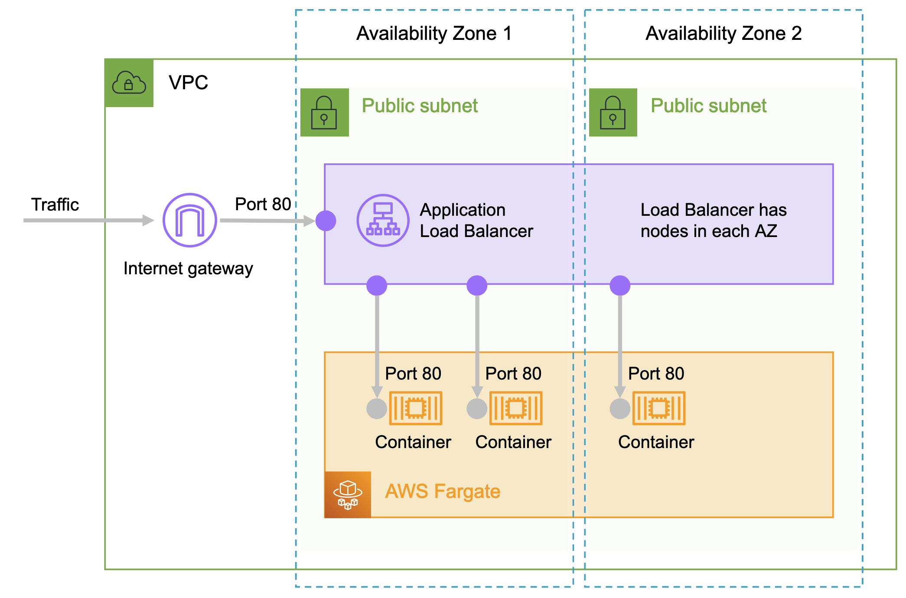

# fargate-sam

Template for deploying a public ALB + ECS Fargate service using CloudFormation and SAM CLI.

Based on https://containersonaws.com/pattern/public-facing-web-ecs-fargate-cloudformation



## Usage

Requires the [AWS SAM CLI](https://docs.aws.amazon.com/serverless-application-model/latest/developerguide/install-sam-cli.html) to be installed.

```
 Choose a make command to run

  build       create ecr repo and build/push image         make build name=my-app dockerfile=../
  infra       deploy infrastructure only                   make infra name=my-app
  infra-app   deploy infrastructure and build/deploy app   make infra-app name=my-app dockerfile=../
  delete      delete entire stack                          make delete name=my-app
```

You can set your app specific parameters in the [stack.yml](./stack.yml) file. For example:

```yaml
# container settings
ServiceName: my-app
ContainerCpu: 256
ContainerMemory: 512
ContainerPort: 8080
DesiredCount: 1
HealthCheckPath: /health
ImageUrl: public.ecr.aws/aws-containers/proton-demo-image:2d7f777
```

If you want to provision cloud resources, build local code into an image, and deploy it using a single command, you can use the following, specifying the name and the releative location of your Dockerfile.

```sh
make infra-app name=my-app dockerfile=../
```

If you want to only provision the cloud resources and use another tool to build and deploy your container image on top, you can run the following which will deploy a tiny default backend image that only responds to health checks.

```sh
make infra name=my-app
```

